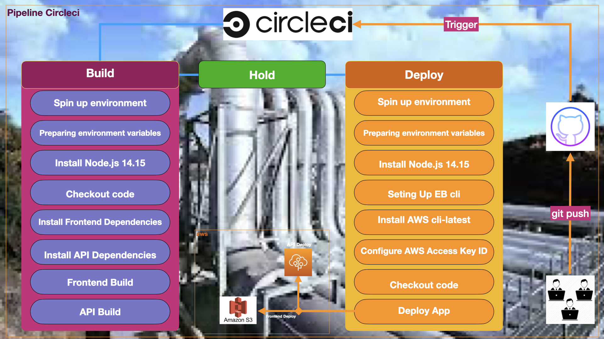

# بسم الله الرحمن الرحيم

## Circleci_Pipeline

## Pipeline
The developer push code to github or other platform, the github triggers circleci which is the Pipeline we used in this app.
The cicleci needs `.circleci/config.yml` file which includes all jobs and steps to run. In our case we have [build, deploy] with their steps.