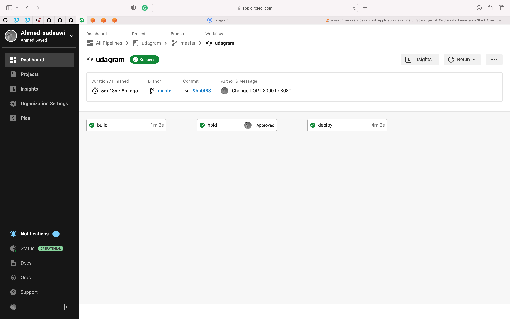
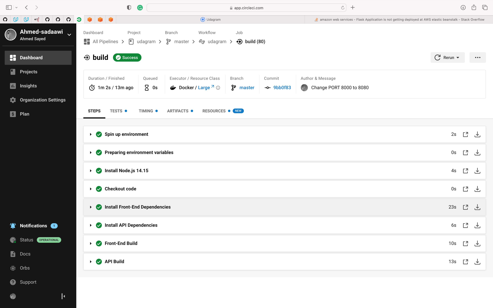
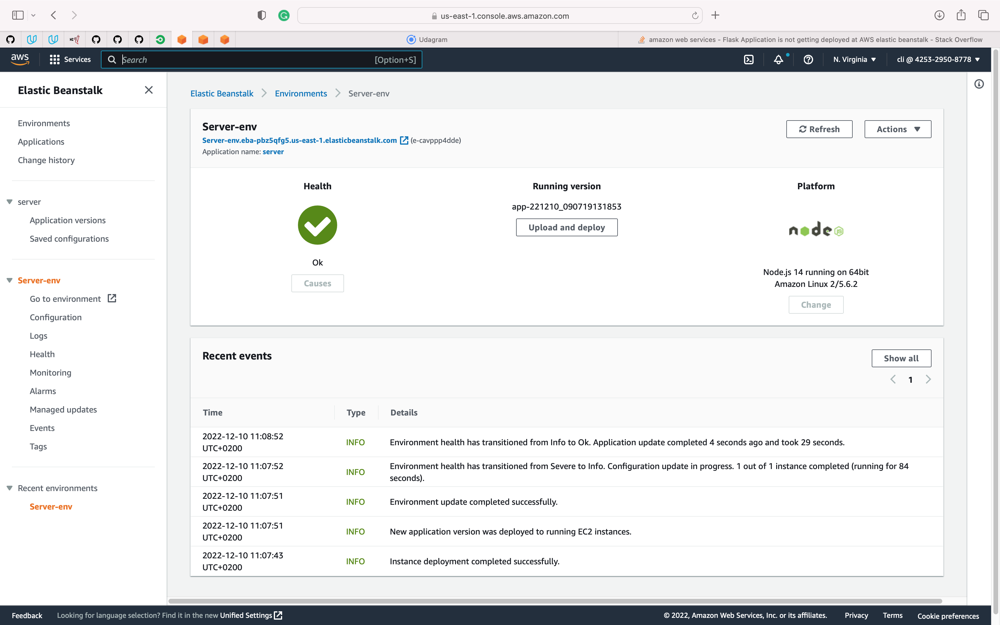
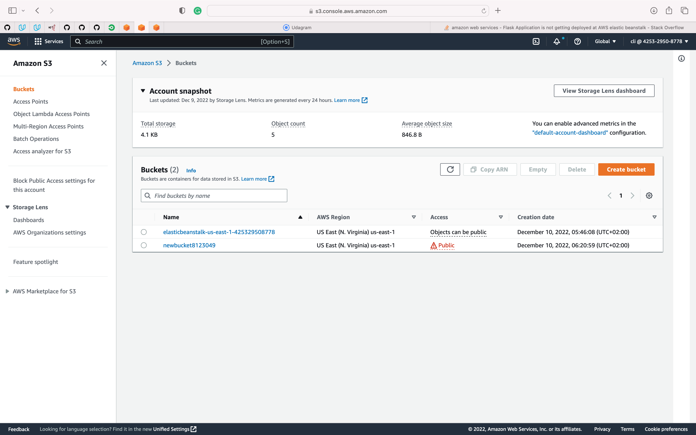
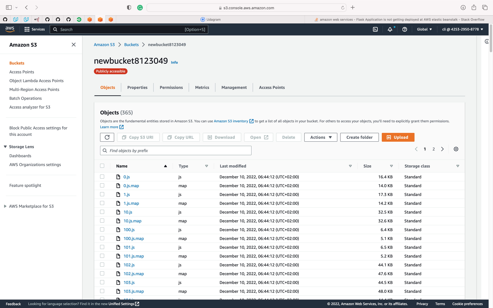
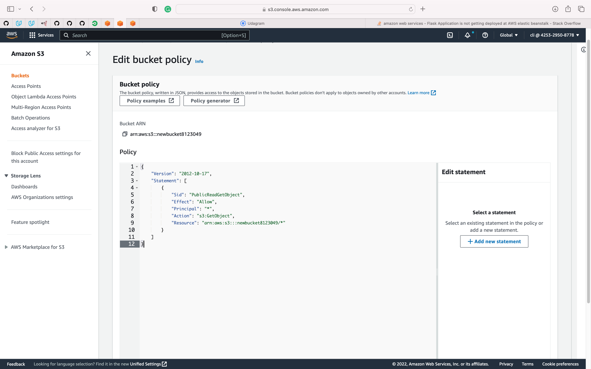
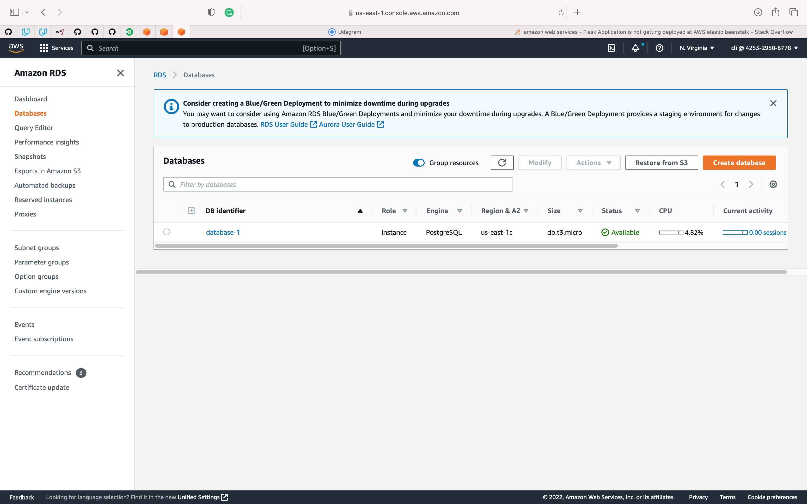
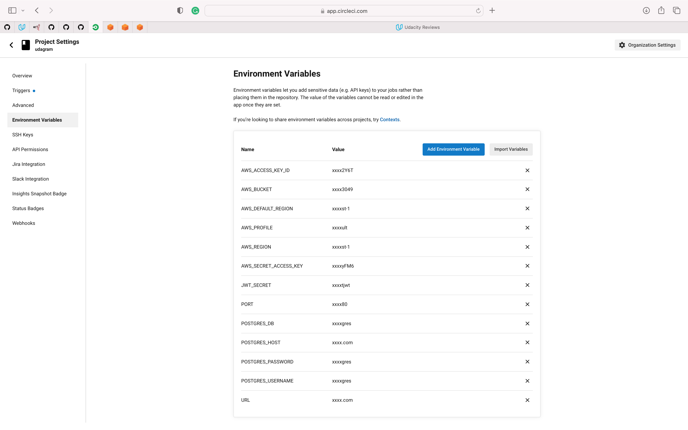

# All Screenshots"

## All_Popelines

## udagram

## Build

## deploy

## Elastic_Beanstalk_Health

## EB_Endpoint&port

## S3_bucket

## S3_bucket_files

## S3_bucket_policy

## DB_identifier

## Circleci_vars

