# All Screenshots"

## All_Pipelines
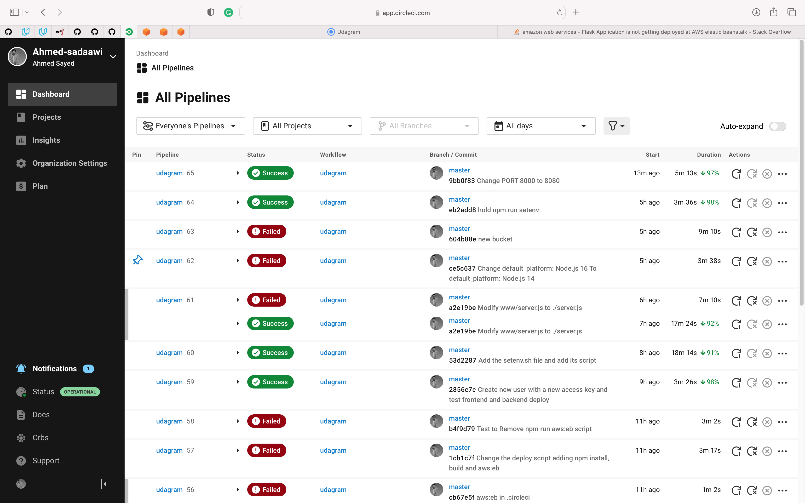

## udagram
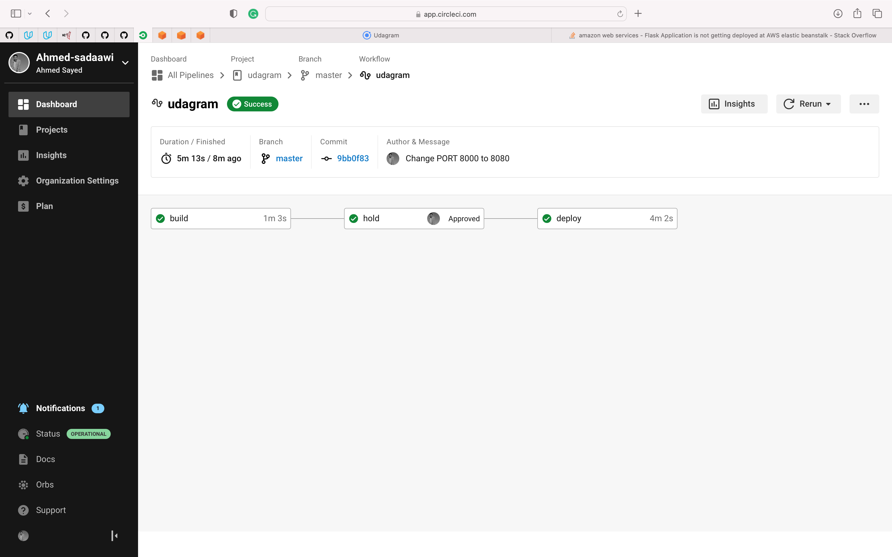

## Build
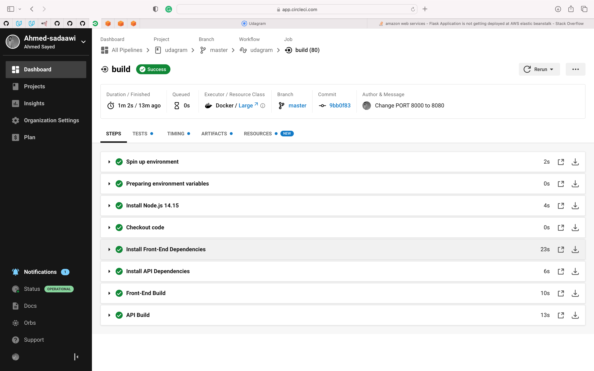

## deploy
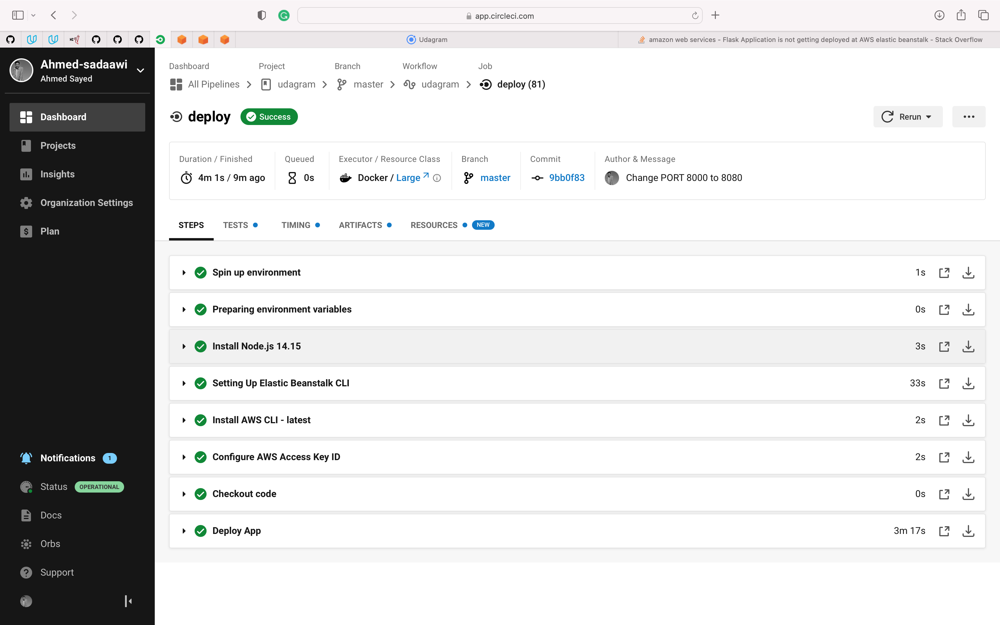

## Elastic_Beanstalk_Health
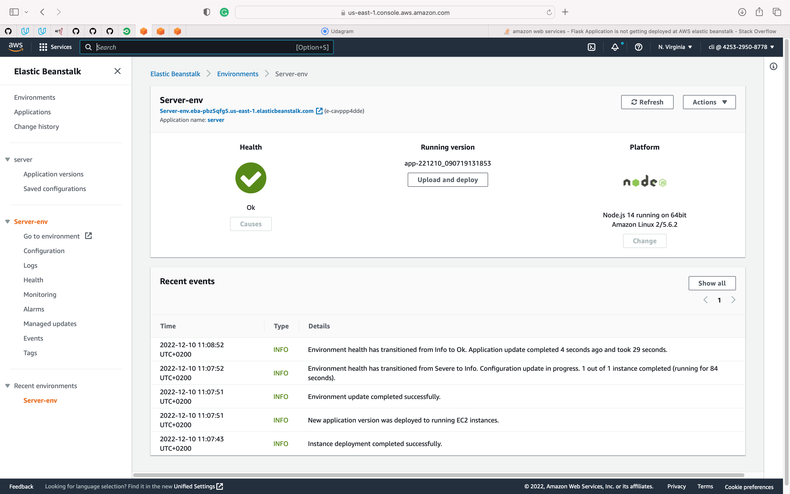

## EB_Endpoint&port
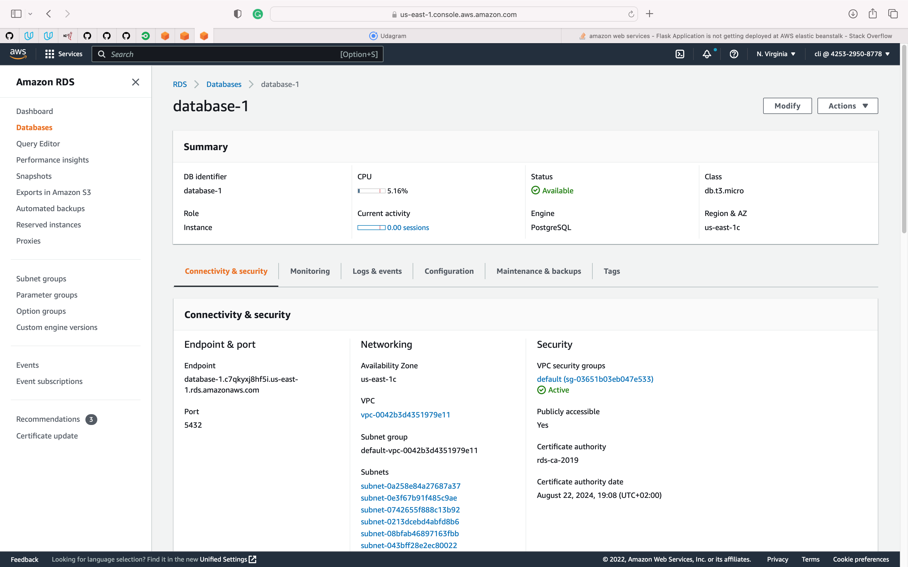

## S3_bucket
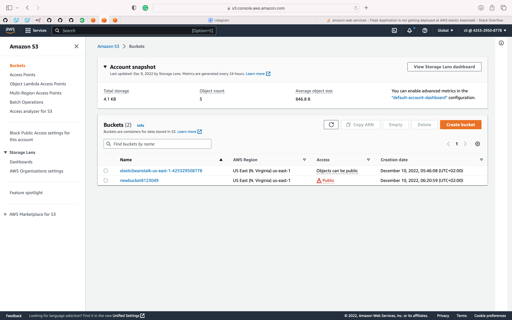

## S3_bucket_files
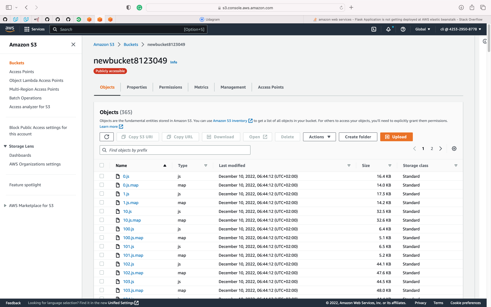

## S3_bucket_policy
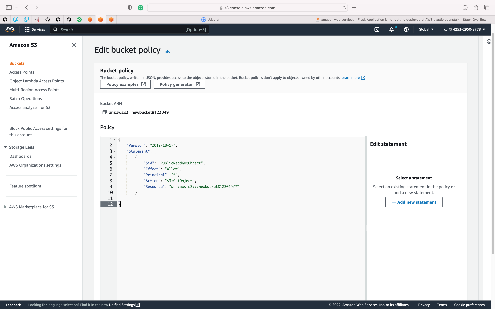

## DB_identifier
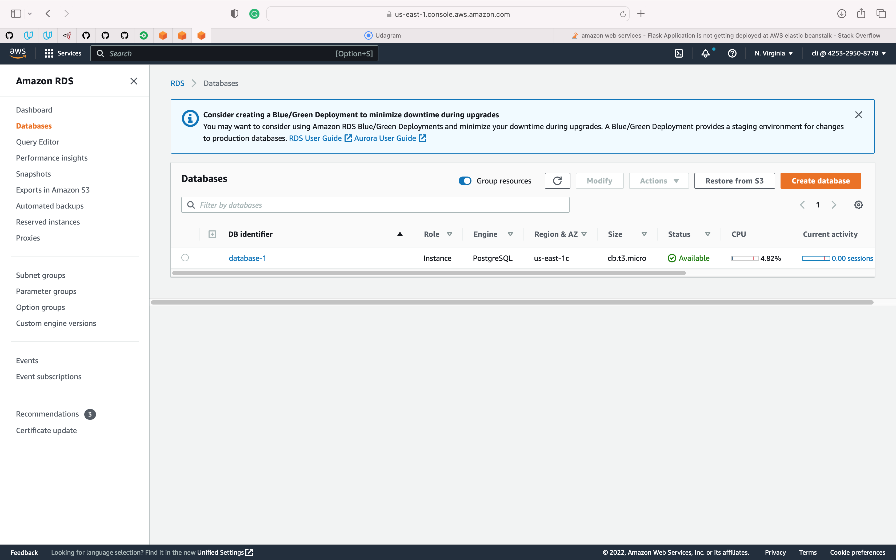

## Circleci_vars
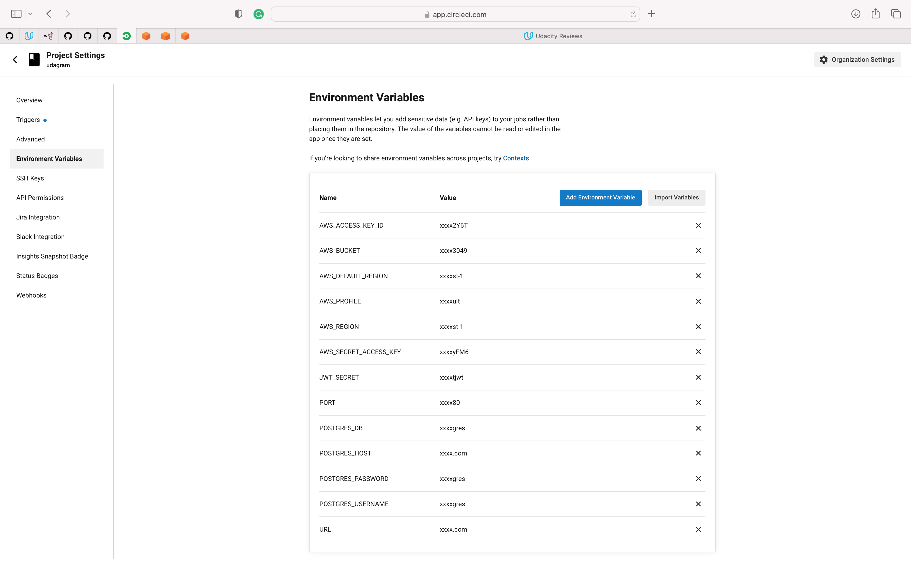
